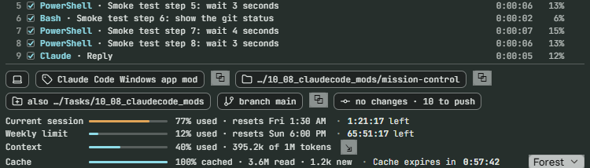
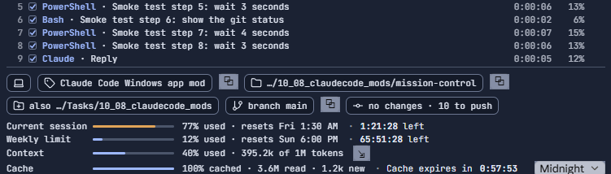
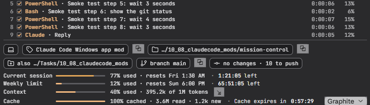
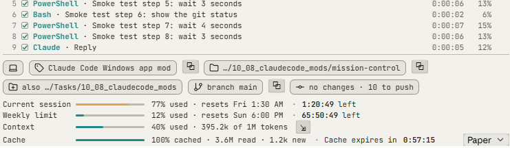
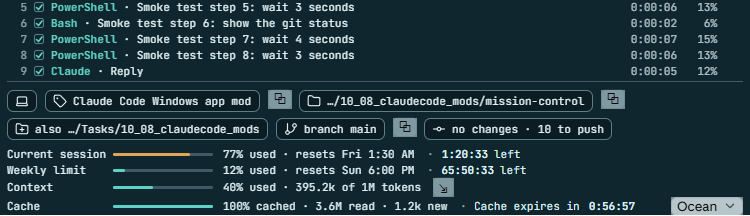
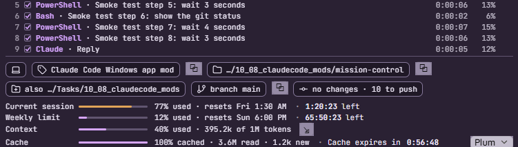
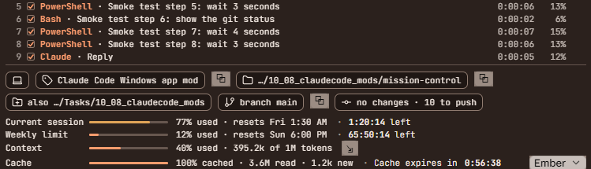
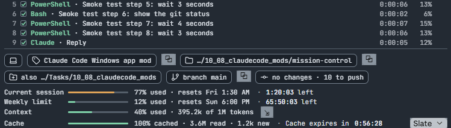
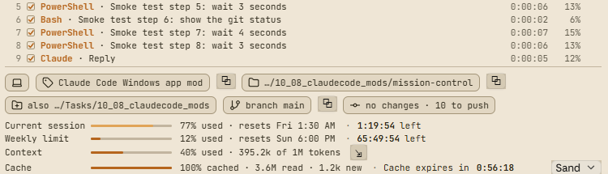

# mission-control

A Claude Code plugin that draws a panel above the prompt, showing what the
session is doing and what it is costing.



## What it shows

- **Work in progress.** A numbered row per step of the current turn: the tool
  used, what the call was for, how long it took and its share of the turn. A
  thin strip along the top animates while a turn runs. When the turn ends the
  summary reads "Completed" with the total time, and a segmented bar shows
  where the time went.
- **Session.** Whether Claude runs locally or in the cloud, the session name,
  the working directory (last two folders), any other directories, the worktree
  and branch, and git status (changed files, commits to push and to pull).
- **Usage.** Current session and weekly limits with the time left until each
  resets, context window use, and how much of the last turn's input came from
  the prompt cache.
- **Clocks.** Conversation time, and a countdown to when the prompt cache
  expires.

## Controls

- A copy button beside the session name, working directory and branch.
- Paging arrows beside the summary when a turn has more than five steps.
- A compact button beside the Context bar, which runs `/compact` once Claude
  is idle.
- A theme dropdown in the bottom right corner. The choice is remembered across
  sessions.

## Install

1. Open a Claude Code terminal session and type this at the prompt:

   ```
   /plugin install mission-control --marketplace bvur/mission-control
   ```

2. Answer `y` to add the marketplace.
3. Choose a scope. User scope loads the panel in every session, including the
   desktop app.
4. Start a new session, or run `/reload-plugins` in the current one. The panel
   appears above the prompt.

For the intended look, install the
[JetBrains Mono](https://www.jetbrains.com/lp/mono/) font. Without it the
panel uses Consolas or the system monospace font.

### Update

```
claude plugin update mission-control@mission-control
```

Then run `/reload-plugins`, or start a new session.

### Uninstall

```
claude plugin uninstall mission-control@mission-control
```

## Themes

Pick a theme from the dropdown in the panel's bottom right corner.

| | |
|---|---|
| **Forest** (default)<br> | **Midnight**<br> |
| **Graphite**<br> | **Paper**<br> |
| **Ocean**<br> | **Plum**<br> |
| **Ember**<br> | **Slate**<br> |
| **Sand**<br> | |

## Requirements and limits

- Built and tried in the Claude Code desktop app on Windows. In a terminal
  session the panel falls back to plain text, without icons, animation or
  ticking clocks.
- The panel is sized for the desktop app's default prompt width. In a narrower
  window it is scaled down.
- The cache countdown assumes a 60-minute prompt cache. Change
  `CACHE_MINUTES` in `hooks/register.tsx` to 5 if your plan uses the
  five-minute cache. The countdown is an estimate: it restarts when a turn
  ends.
- The work-in-progress list shows five steps at a time.
- Buttons and the dropdown are drawn by the app, so they keep the app's own
  style on every theme.

## Development

```
claude plugin validate .
claude plugin test .
```

Icons are from [Lucide](https://lucide.dev) (ISC licence).
